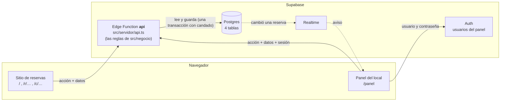
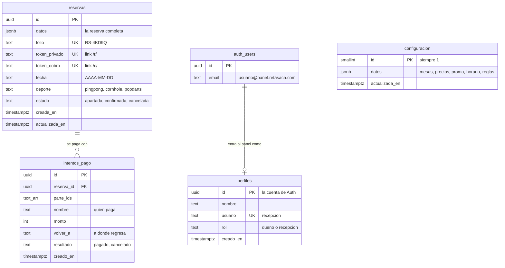

# Base de datos (Supabase)

Cómo quedó la versión real: dónde viven los datos, cómo están acomodadas las
tablas, quién puede tocar qué y cómo se cambia algo sin romperlo. Para las
reglas del negocio, [`RESERVAS.md`](RESERVAS.md); para el contrato entre las
pantallas y los datos, [`CONTRATO-DE-DATOS.md`](CONTRATO-DE-DATOS.md).

## Cómo está armado



- **El navegador nunca lee ni escribe tablas.** Todo pasa por una sola Edge
  Function, `api`, que recibe `{ accion, datos }` ("apartar", "extender",
  "marcarPago"…), revisa quién la pide, llama a la regla de
  `src/negocio/operaciones` (las MISMAS que usa la versión simulada) y guarda.
- **La única excepción:** el panel con sesión puede *leer* `reservas`, porque
  Realtime solo avisa de los cambios a quien puede leerlos. Así la laptop de
  recepción se entera sola cuando entra una reserva.
- **La hora es la del servidor**, nunca la del teléfono.

## Las tablas



| Tabla | Qué guarda | Notas |
|---|---|---|
| `configuracion` | **Una sola fila** (`id = 1`) con todo lo que Hugo edita en el panel: mesas, precios, promo, horario, días cerrados, reglas y WhatsApp del negocio. | La primera vez que alguien la pide y no existe, el servidor la crea con `CONFIGURACION_INICIAL` de `src/negocio/configuracion.ts`. |
| `reservas` | Cada reserva **completa** en `datos` (la forma exacta de `Reserva` en `src/negocio/reserva.ts`: partes, pagos, cancelación, mesa…). | `folio`, `token_privado`, `token_cobro`, `fecha`, `deporte` y `estado` son **columnas generadas** a partir de `datos`: sirven para buscar rápido y para que la base impida repetidos. Nunca se escriben a mano. |
| `intentos_pago` | Cada pago en línea que alguien empieza: qué partes, a nombre de quién, cuánto y cómo terminó. | Con Mercado Pago aquí irá el id de la preferencia. |
| `perfiles` | Quién entra al panel y con qué rol. | Tener cuenta en Auth no basta para entrar: hace falta una fila aquí. El rol vive aquí y no en los metadatos del usuario, que el propio usuario puede editar. |
| `auth.users` | Las cuentas de Supabase Auth. | La trae Supabase. No se toca con SQL: las cuentas las crea el dueño desde el panel. |

### Por qué la reserva va entera en `datos`

Las reglas (`src/negocio/operaciones`) trabajan con la reserva completa y
devuelven la reserva completa. Guardarla igual evita traducir de ida y vuelta
entre tablas y objeto, que es donde se pierden campos. Las columnas que hacen
falta para buscar y para las restricciones se *calculan* de `datos`, así que
nunca se desalinean.

## Quién puede tocar qué

| | Sin sesión (el sitio) | Con sesión del panel | La función `api` |
|---|---|---|---|
| `configuracion` | ✗ | ✗ | lee y escribe |
| `reservas` | ✗ | **solo lee** (Realtime) | lee y escribe |
| `intentos_pago` | ✗ | ✗ | lee y escribe |
| `perfiles` | ✗ | ✗ | lee y escribe |

- **RLS encendido en las cuatro tablas** y todos los permisos de `anon` y
  `authenticated` quitados. Lo único concedido es leer `reservas` con sesión,
  y la política lo limita a quien tiene perfil del panel.
- Esa política usa `privado.es_del_panel()`: vive en un esquema que la API no
  publica, solo responde por el usuario de la sesión (`auth.uid()`) y `anon`
  no la puede ejecutar. En Supabase, `revoke … from public` no se la quita a
  `anon`: por eso se nombra a los dos.
- La función `api` se conecta con el rol de la base (`SUPABASE_DB_URL`), que
  no pasa por RLS. Por eso ninguna consulta de `supabase/fuentes/postgres.ts`
  sale nunca al navegador.

Medido contra el proyecto real, con la llave pública y sin sesión: leer o
escribir cualquiera de las cuatro tablas responde `permission denied`.

## Que no se venda una mesa dos veces

Todo lo que ocupa mesa (apartar, anotar sin reserva, extender, cambiar
horario, asignar mesa, cobrar…) corre dentro de **una transacción con un
candado** (`pg_advisory_xact_lock`): leer las reservas, revisar el lugar y
guardar pasan juntos, y la siguiente espera su turno. Para el tamaño del local,
una sola fila de espera es de sobra.

Medido contra el proyecto real: 5 personas apartando al mismo tiempo el mismo
horario de Popdarts (3 mesas) → entran 3 y 2 reciben "Alguien acaba de tomar la
última mesa de ese horario".

## Usuarios del panel

- Se entra con **usuario y contraseña** (`recepcion`, `hugo`…), sin correo: el
  panel solo se usa en el local.
- Supabase Auth solo entra con correo, así que cada usuario se guarda por
  dentro como `<usuario>@panel.retasaca.com` (`src/datos/usuarios.ts`). Es un
  subdominio del negocio y **nunca se le manda correo**.
- El dueño da de alta a cada persona desde el panel (Configuración → Quién
  entra al panel) con su usuario y una contraseña de al menos 8 caracteres. La
  cuenta se crea ya confirmada.
- **La primera cuenta de dueño** se crea en la entrega, porque todavía no hay
  nadie que pueda dar altas:
  1. Supabase → *Authentication → Users → Add user → Create new user*: correo
     `hugo@panel.retasaca.com`, su contraseña y **Auto Confirm User**.
  2. En el SQL Editor:
     ```sql
     insert into public.perfiles (id, nombre, usuario, rol)
     select id, 'Hugo', 'hugo', 'dueno' from auth.users where email = 'hugo@panel.retasaca.com';
     ```

## Cambiar algo

### El esquema (tablas, permisos)

Una migración nueva por cambio, en `supabase/migrations/`, creada con
`npx supabase@2.118.0 migration new <nombre>` (nunca inventando el nombre).
Se aplica pegándola en el **SQL Editor** del proyecto. Las migraciones de este
proyecto se aplicaron así, no con `supabase db push`: si algún día se usa la
CLI, primero hay que marcarlas como aplicadas con `supabase migration repair`.

| Migración | Qué hace |
|---|---|
| `20260929034026_esquema.sql` | Las cuatro tablas, RLS, permisos, la política del panel y Realtime. |
| `20260929164015_usuarios_del_panel.sql` | En `perfiles`, `correo` pasa a ser `usuario`, con la regla de nombres válidos. |

### El servidor (la función `api`)

1. El código está en `src/servidor/api.ts` (qué acción hace qué) y en
   `supabase/fuentes/` (la conexión con Postgres y Auth). Las reglas siguen en
   `src/negocio/operaciones`.
2. `npm test`: las pruebas del contrato corren contra la versión simulada **y**
   contra este mismo servidor con la base en memoria. Si una falla en "real" y
   no en "simulado", el problema está en el servidor.
3. `npm run servidor:empaquetar` junta todo en
   `supabase/functions/api/index.js` (las Edge Functions no leen fuera de su
   carpeta). Ese archivo no va a GitHub: se genera.
4. Se sube pegando ese archivo en Supabase → *Edge Functions → api → Code*, o
   con `npx supabase@2.118.0 functions deploy api` si la CLI tiene sesión.
5. En *Settings* de la función, **Verify JWT debe quedar apagado**: el sitio
   llama sin sesión y la sesión del panel la revisa el propio servidor.

### Ajustes de la función (*Edge Functions → Secrets*)

| Nombre | Valor | Para qué |
|---|---|---|
| `MP_ACCESS_TOKEN` | El *Access Token* de Mercado Pago | Con él, el pago en línea va por Mercado Pago. El de **prueba** cobra de mentira; para abrir al público se cambia por el de **producción** de la cuenta del negocio. |
| `MP_USAR_SANDBOX` | `si` (opcional) | Solo si con la llave de prueba Mercado Pago pide su página de pruebas (`sandbox_init_point`) en vez de la normal. |
| `PAGOS_SIMULADOS` | `si` | Sin `MP_ACCESS_TOKEN`, el pago en línea es la pantalla de prueba del sitio. Con la llave puesta se ignora. **Sin Mercado Pago no se debe abrir al público**: cualquiera "paga" sin pagar. |

`SUPABASE_URL`, `SUPABASE_DB_URL` y las llaves de servidor las pone Supabase
solo; ninguna llave secreta va en el código.

## El sitio con datos reales

El sitio usa la versión real si al compilar tiene estas variables (en
`.env.local` para esta computadora, o en el servicio donde se publique):

```bash
VITE_DATOS=real
VITE_SUPABASE_URL=https://<proyecto>.supabase.co
VITE_SUPABASE_LLAVE_PUBLICA=sb_publishable_…
```

Las tres son públicas por diseño (terminan dentro del sitio). La llave
**secreta** nunca va ahí. Sin `VITE_DATOS=real` el sitio sigue en modo
demostración, con los datos en el navegador.

## Pendiente

- **Mercado Pago de producción**: el cobro ya está conectado y se prueba con la
  llave de prueba. Para cobrar de verdad falta la cuenta del negocio y cambiar
  `MP_ACCESS_TOKEN` por su llave de producción.
- **Que Supabase no pause el proyecto**: los proyectos gratis se pausan tras
  una semana sin actividad.
- **La cuenta de dueño**: se crea en la entrega (arriba).
